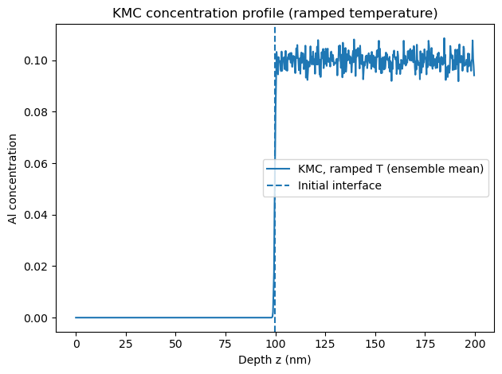
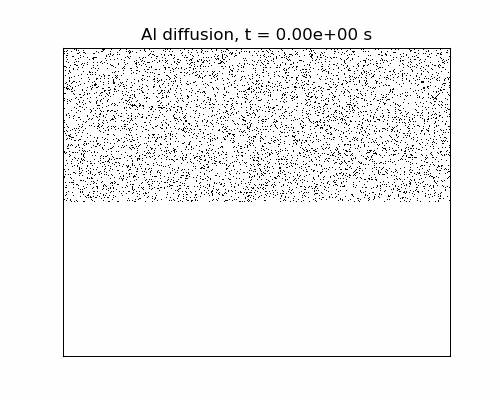
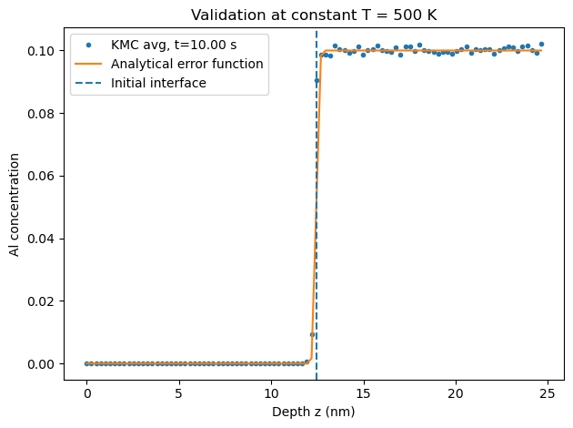
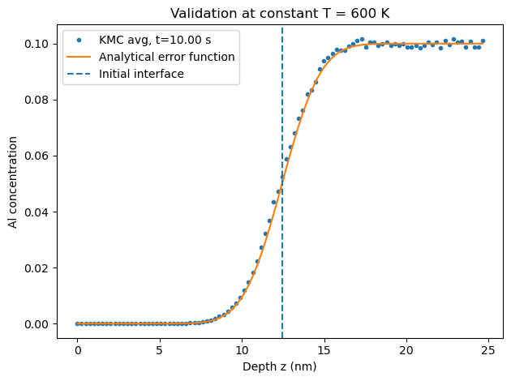
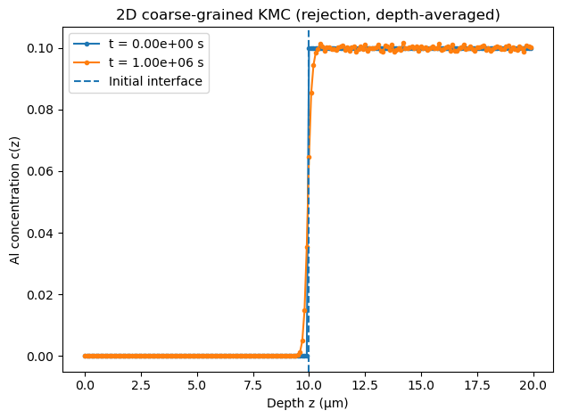
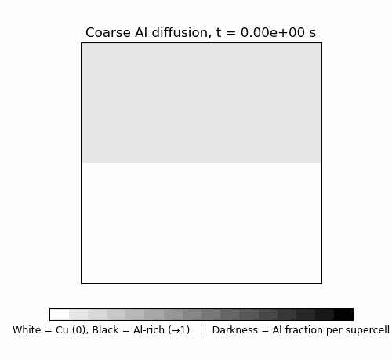
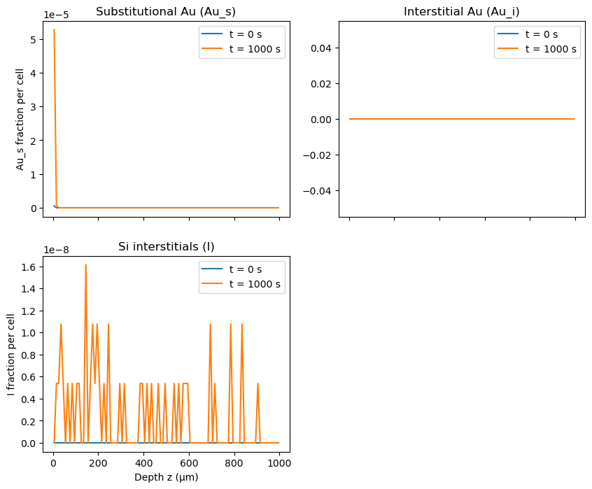
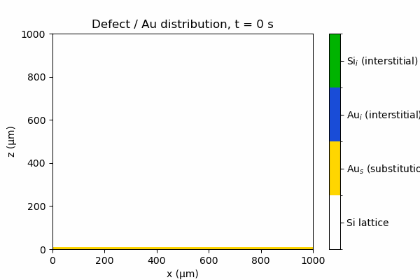

# Kinetic Monte Carlo Simulations — Al Diffusion in Cu & Au Diffusion in Si

**Course:** Materials Simulation Practical | FAU Erlangen-Nürnberg  
**Tools:** Python · NumPy · SciPy · Matplotlib

📓 [Written report](report.ipynb) | 💻 [Simulation code](kmc_simulation.ipynb)

---

## Overview

Implementation of Kinetic Monte Carlo (KMC) methods to simulate thermally activated diffusion at atomistic and coarse-grained scales. Three systems are studied: (1) atomistic KMC of Al diffusion in a Cu/Cu-Al bilayer under constant and ramped temperature, validated against the analytical error function solution; (2) coarse-grained 2D KMC of the same system scaled to the micron level; and (3) KMC simulation of Au diffusion in Si via the kick-out mechanism, involving coupled interstitial and substitutional species.

---

## Atomistic KMC: Al Diffusion in Cu

Al atoms diffuse in a 25×25 nm² Cu/Cu-10%Al bilayer lattice via nearest-neighbor random walks. Jump rates follow an Arrhenius law with D₀ = 1.49×10⁻⁷ m²/s and activation energy Q = 137.1 kJ/mol. An ensemble of 10 independent runs is averaged to reduce stochastic noise.

<table>
<tr>
<td></td>
<td></td>
</tr>
<tr>
<td align="center">Concentration profile — ramped temperature</td>
<td align="center">Atomistic diffusion animation</td>
</tr>
</table>

### Validation Against the Analytical Solution

KMC concentration profiles are benchmarked against the analytical error function solution c(z,t) = c₀/2 · erfc((z−z₀)/√(4Dt)) at constant temperature.

<table>
<tr>
<td></td>
<td></td>
</tr>
<tr>
<td align="center">T = 500 K — interface remains sharp, minimal diffusion</td>
<td align="center">T = 600 K — broader interface, KMC tracks analytical solution</td>
</tr>
</table>

Under a linear temperature ramp (298 K → 600 K) the effective diffusion length is shorter than at constant T = 600 K, since most of the annealing time is spent at lower temperatures where D is exponentially suppressed.

---

## Coarse-Grained 2D KMC: Al Diffusion at the Micron Scale

The atomistic model is upscaled to a 200×200 coarse grid covering a 20×20 µm² domain. Each supercell contains many atoms and jump rates are computed from the local Al fraction using the same Arrhenius expression.

<table>
<tr>
<td></td>
<td></td>
</tr>
<tr>
<td align="center">Depth-averaged concentration profile (t = 0 and t = 10⁶ s)</td>
<td align="center">Coarse-grained diffusion animation</td>
</tr>
</table>

The depth-averaged profile shows virtually no interface broadening at the micron scale, consistent with the low diffusivity at the simulation temperature over this timescale.

---

## Au Diffusion in Si via the Kick-Out Mechanism

Au diffusion in Si proceeds through a coupled three-species mechanism. Au interstitials (Au_i) entering from the surface displace Si lattice atoms via kick-out reactions, producing substitutional Au (Au_s) and Si self-interstitials (I). Parameters: k_f = 600 s⁻¹, k_b = 10 s⁻¹, D = 10⁻⁹ m²/s for both Au_i and I, on a 1×1 mm² Si wafer.

<table>
<tr>
<td></td>
<td></td>
</tr>
<tr>
<td align="center">Species profiles at t = 0 and t = 1000 s</td>
<td align="center">Au kick-out mechanism animation</td>
</tr>
</table>

Au_s accumulates near the surface (z ≈ 0) where Au_i enters, consistent with the kick-out mechanism driving substitutional incorporation near the source. Si interstitials (I) are distributed throughout the bulk at very low concentration (~10⁻⁸ per cell), reflecting their rapid diffusion away from kick-out events. Au_i concentration remains negligible in the bulk due to the strongly forward-biased reaction (k_f ≫ k_b).

---

## Requirements
```bash
pip install numpy scipy matplotlib
```

---

## Usage

Open `kmc_simulation.ipynb` in Jupyter and run cells sequentially. Task 2.1 runs an ensemble of 10 KMC trajectories (~2–5 min). Task 2.3 simulates a 1×1 mm² Si wafer and may take 10–15 minutes depending on event frequency.
